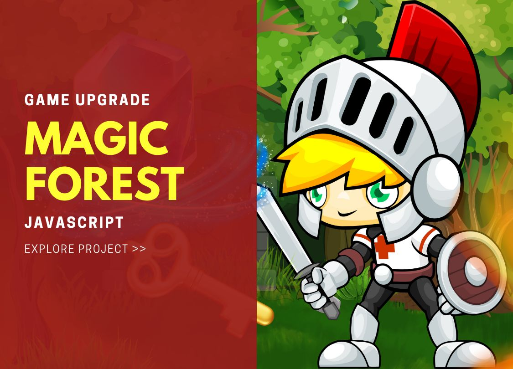
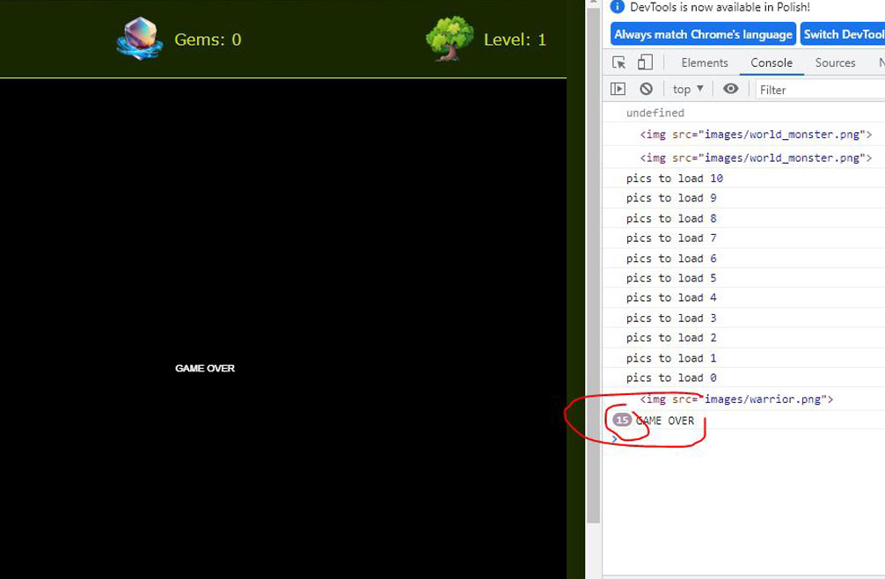
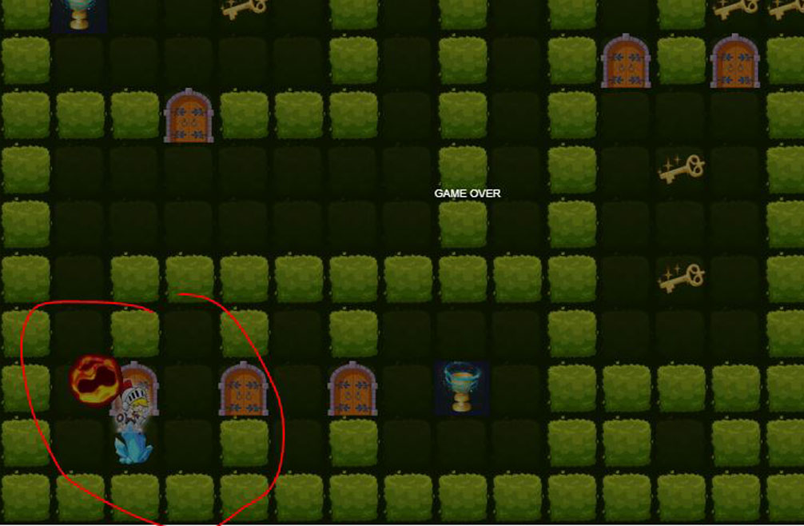

# Project Summary: Magic Forest – Game Upgrade

## Why this project? 
I've always been curious about how games work, and I find that I learn most effectively when I investigate topics that interest me and creatively explore them. I embarked on a short training journey that demonstrated the construction of old-school tile-based games. Later, I delved into understanding and tinkering with the code, drawing inspiration from classic adventure games and well-known paddle games. Initially, the app lacked any engaging features or challenges; the warrior character could only move and open doors.

## New features added by me: 
I introduced the possibility to win or conclude the game, providing clear communication to the player. Players can now progress to more challenging levels (with three levels available in the demo version). I implemented traps, including static fireballs (touching a Fire tile ends the game) and dynamic fireballs (inspired by the behavior of balls in paddle games). The dynamic fireballs change directions after reaching certain x and y coordinates. A basic scoring system has been incorporated, allowing players to collect magic gems. The number of gems collected does not reset after completing a level. I enhanced the visual experience using Photoshop and Canva stock graphics. Sound effects have been added, enhancing the overall gameplay experience.

## Issues with the code: 
I addressed several issues with the code, including outdated practices such as using function names like 'warriorClass' instead of real classes and constructors. I replaced 'var' declarations with 'let' for improved code clarity. Additionally, I meticulously reviewed all lines of code and identified unnecessary pieces, such as a rotating function that was never utilized.

## Testing & Bugs: 
I conducted thorough testing to ensure the game's functionality. I checked if it was possible to win the game and tested all functionalities after every significant code modification, which boosts my confidence in the project. 

Bug 1: A warrior character with coordinates (x 251, y 251) caused the game to end unexpectedly, despite being far away from a dynamic fireball. This was caused by a piece of code that was accidentally left in. 

Bug 2: The 'endGame' function was called multiple times after losing a game. I rectified this issue to ensure it is only called once. 

Bug 3: After uploading Level 2, the warrior was erroneously placed on a fireball tile, resulting in an immediate game over.

## Future considerations: 
Implementing multiple lives, allowing players to gain and lose lives, and resetting the game after all lives are lost. Introducing the ability to gain lives during gameplay, similar to collecting gems and keys. Incorporating multiple dynamic fireballs, each with different directions or changeable speeds.

## Summary: 
Throughout this project, I delved into JavaScript's object-oriented programming paradigm, mastering concepts like classes and constructors to enhance the codebase. I updated outdated practices to modern standards and debugged to ensure seamless functionality. By integrating new features such as traps and scoring systems, I deepened my expertise in JS app development.
